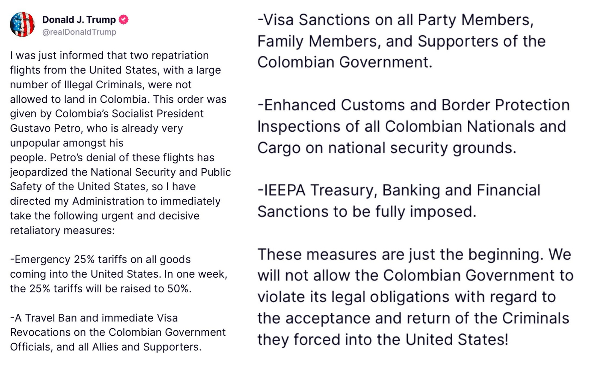
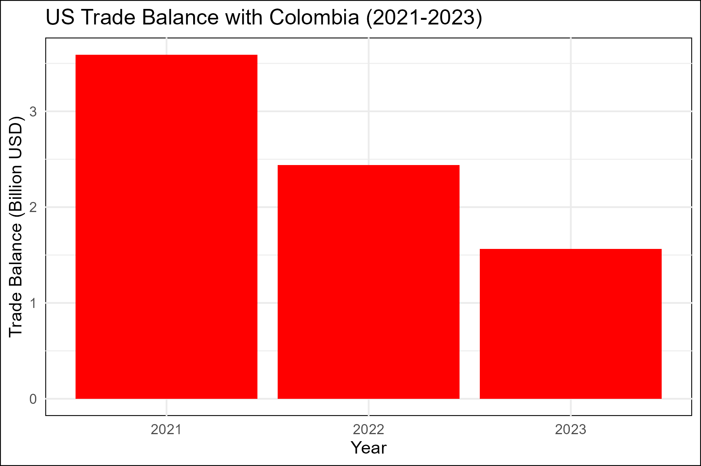

Today Trump unexpectedly announced 25% tariffs on Colombia for refusing to lend 2 airplains with Colombina nationals, who were extradicted from the US. Trump said he has ordered an emergency 25% tariff on all Colombian goods coming into the US, which will be raised to 50% in one week. He has also called for a travel ban and immediate visa revocations on Colombian government officials “and all Allies and Supporters” as well as visa sanctions on party members, family members and supporters of the government of President Gustavo Petro. There is no official records of this, it was announced on Trump's Twitter account:

Interestingly, US has a trade surplus with Colombia, so it is not clear what Trump is trying to achieve with this move.

**Update:** The issue has been parked and resolved for now with no actions taken by the US. 
