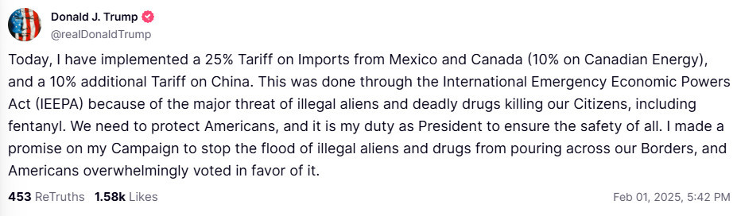
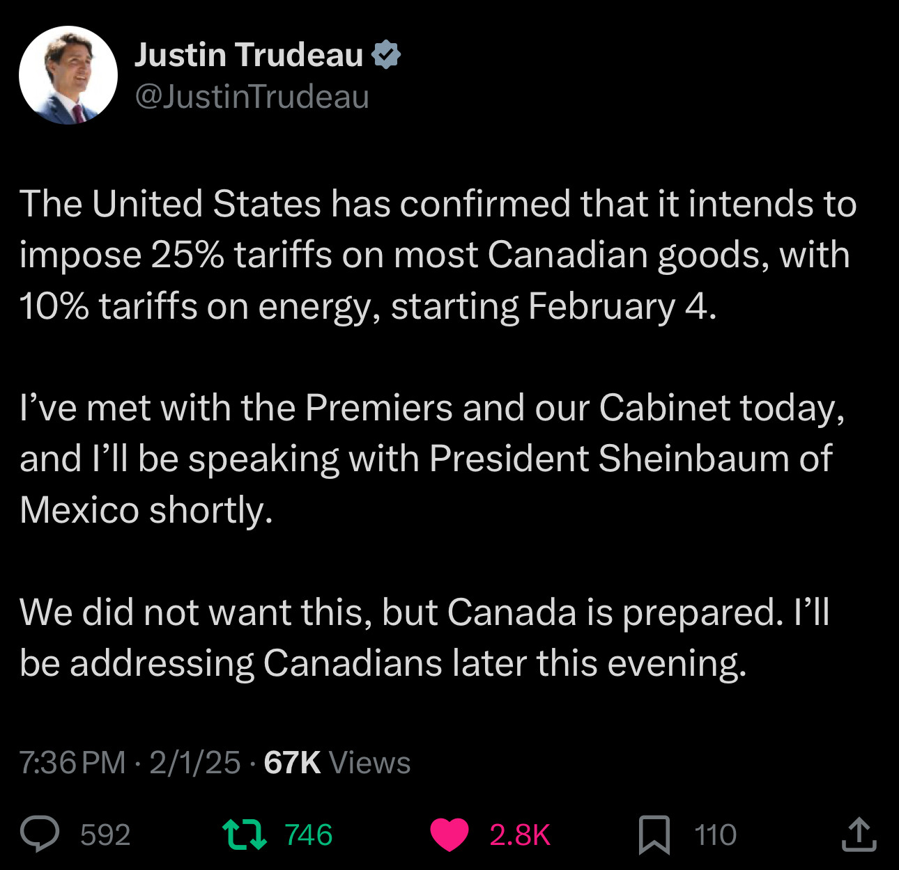

**Summary:**

The US is set to implement steep tariffs on its three largest trading partners—Canada, Mexico, and China—beginning February 1. Under President Trump’s directive, Canada and Mexico will face a 25% tariff, while China will be subject to a 10% levy. White House press secretary Karoline Leavitt emphasized that these measures are being executed as promised by the president, dismissing reports of any delays.

The announcement has raised fears of triggering a broader trade war, with both Canada and Mexico preparing retaliatory tariffs. Canadian Prime Minister Justin Trudeau warned that the nation might face tough times ahead, and opposition figures in Canada suggested additional punitive measures, such as imposing tariffs on Tesla vehicles.

Amid these developments, there is some discussion about potentially excluding oil imports from the tariffs—given the US’s reliance on Canadian oil—but no decision has been finalized. The move marks a significant escalation in trade tensions early in Trump’s second term.

Here is a general equilibrium analysis of the impact of tariffs on trade and welfare:

| Scenario                                   | Country | Exports  | Imports  | Domestic | Output  | Welfare |
|--------------------------------------------|---------|----------|----------|----------|---------|---------|
| A Trump tariffs: CHN 10%, CAN 25%, MEX 25%   | MEX     | -26.117  | -28.575  | 6.805    | -2.81   | -5.098  |
| A Trump tariffs: CHN 10%, CAN 25%, MEX 25%   | CAN     | -23.895  | -26.385  | 4.789    | -2.021  | -3.715  |
| A Trump tariffs: CHN 10%, CAN 25%, MEX 25%   | USA     | -18.096  | -12.909  | 0.84     | -0.377  | -0.725  |
| A Trump tariffs: CHN 10%, CAN 25%, MEX 25%   | CHN     | -1.06    | -1.997   | 0.162    | -0.091  | -0.214  |
| B With retaliation                         | MEX     | -38.096  | -41.087  | 9.982    | -4.015  | -7.199  |
| B With retaliation                         | CAN     | -39.68   | -43.001  | 8.019    | -3.273  | -5.899  |
| B With retaliation                         | USA     | -25.963  | -18.091  | 1.226    | -0.529  | -0.973  |
| B With retaliation                         | CHN     | -1.192   | -2.077   | 0.196    | -0.095  | -0.2    |

**Main Points:**

- **Tariffs Reduce Trade and Output:** The imposition of tariffs significantly lowers exports, imports, and overall economic output.
- **Domestic Activity Partially Offsets Losses:** Increased domestic trade occurs but does not fully compensate for the reduction in international trade.
- **Welfare Declines:** All countries experience a decrease in welfare as a result of the tariffs.
- **Retaliation Exacerbates Impacts:** When trading partners retaliate, the negative effects on trade, output, and welfare intensify.

**Conclusion:**

Unilateral tariffs, particularly when met with retaliation, are economically damaging. They disrupt trade flows, lower production, and diminish overall welfare, with countries like Mexico and Canada being especially hard hit.

Today at 6:30PM Trump announced that he is imposing 25% tariffs on Canada and Mexico. Energy imports from Canada will be charged at 10%, which is slightly better condition. China gets 10 percentage points on top of what already existed. The tariffs will be effective from February 4. There is a bizarre justification for the tariffs: Trump claims that Canada, China and Mexico are illegaly exporting fentanyl to the US.

In response, Justin Trudeau announced that Canada will meet with Mexico to discuss a joint response to the tariffs. Mexico has not yet responded to the announcement. Here is what Trudeau said:

The tariffs are expected to have a significant impact on trade and economic relations between the US and its North American partners. The move has already sparked concerns about potential retaliation and the broader implications for the global economy. My analysis of the potential effects of these tariffs on trade and welfare suggests that all countries involved will experience a decline in exports, imports, and overall economic output. The imposition of tariffs is likely to disrupt trade flows, lower production, and diminish welfare across the board. The situation remains fluid, and further developments are expected in the coming days. Here is the analysis

[Analysis of the impact of tariffs on trade and welfare](https://open.substack.com/pub/oleksandrshepotylo/p/trump-tariffs-v20-update?r=184zxb&utm_campaign=post&utm_medium=web&showWelcomeOnShare=false)
