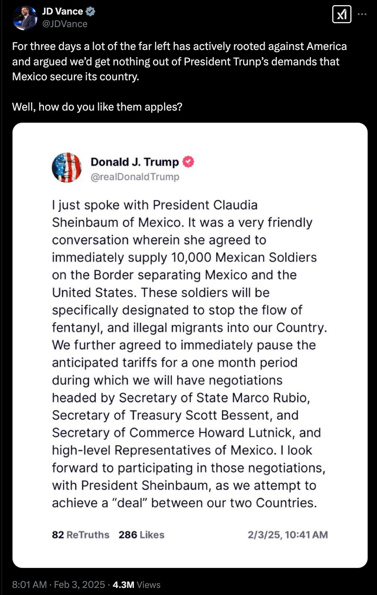

In a miracluous turn of events, Trump announced that he is lifting tariffs on Canada and Mexico. The tariffs were supposed to be effective from February 4, but Trump changed his mind. Here is the tweet:

The decision to lift the tariffs comes after intense negotiations between the US, Canada, and Mexico. The move is expected to ease tensions and improve trade relations between the three countries. Trump claims that he has gotten important concessions from Canada and Mexico and the decision is delayed for 30 days, after which it will be re-evaluated. The tariffs on China remain in place.

Stock market reacted very nervously to the news. 

People felt tricked and there is residual uncertainty about the future of trade relations between the US and its North American partners. The situation remains fluid, and further developments are expected in the coming days.

It is not clear what will happend with Trump announcment against China. He also threatened to impose tariffs on EU products, calling the relationships with EU atrocious.
