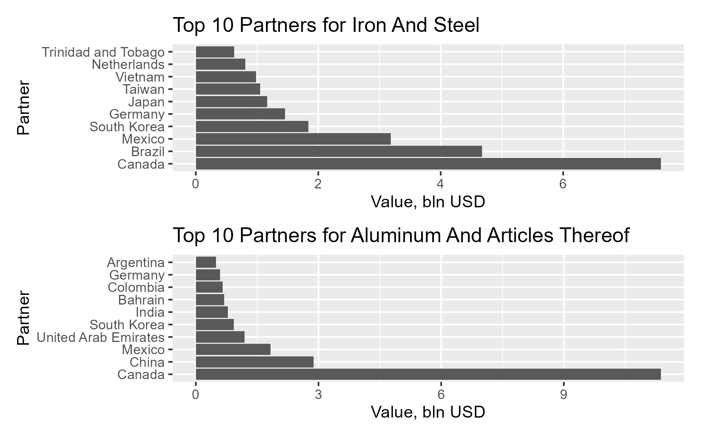
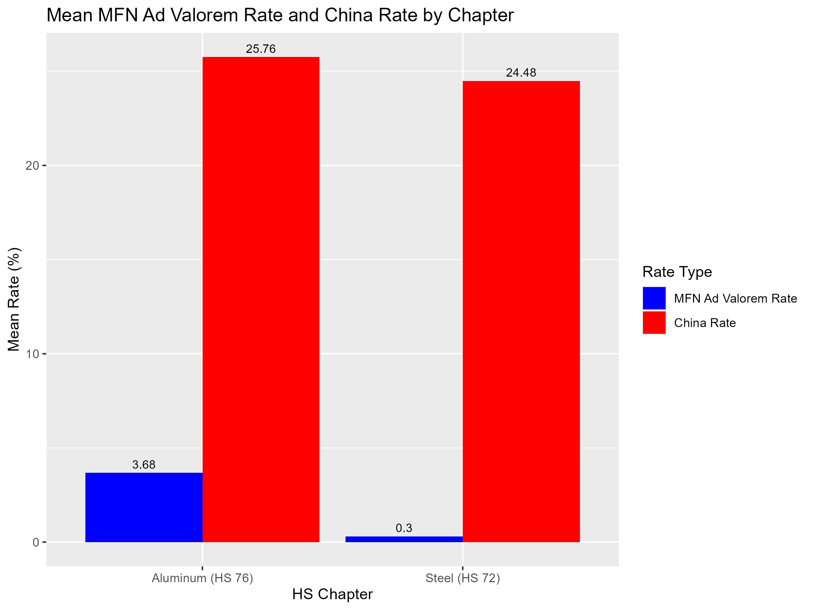

	[link](https://www.ft.com/content/54810a2c-1db7-488b-ab38-7d00c2dcf016)

	Donald Trump said he would on Monday impose 25 per cent tariffs on all steel and aluminium imports, expanding his trade conflicts to the metals sector in a new burst of protectionism from Washington.

By the end of the day, President Trump posted his [presidental action](https://www.whitehouse.gov/presidential-actions/2025/02/adjusting-imports-of-steel-into-the-united-states/) on steel. It is very long, unlike his other acts and go in length into explaining why the comprevensive tariff of 25% on steel is necessary. The main points are:

On February 10, 2025, President Donald Trump announced a proclamation adjusting imports of steel into the United States. Here's a brief overview addressing your specific questions:

1. **Which products are affected?**

   The proclamation imposes a 25% tariff on imported steel articles, which include a range of steel mill products such as flat-rolled steel, long products, pipe and tube products, and stainless steel products. 

2. **Which countries are affected?**

   The 25% tariff applies to steel imports from all countries, effectively removing previous exemptions and alternative arrangements that had been in place with nations such as Canada, Mexico, the European Union, Japan, South Korea, and others. 

3. **When does it come into effect?**

   The new tariffs are set to take effect on March 4, 2025.

4. **Who is excluded?**

   The proclamation does not specify any country exclusions; thus, all countries are subject to the 25% tariff on steel imports. 

5. **Which products are excluded?**

   The proclamation does not detail specific product exclusions. However, it authorizes the Secretary of Commerce to provide relief from the additional duties for any steel article determined not to be produced in the United States in a sufficient and reasonably available amount or of satisfactory quality, or based upon specific national security considerations. 

This action aims to bolster the U.S. steel industry by addressing concerns over national security and the economic impacts of steel imports. US is currently importing aluminum and steel from 

And currently only China has the 25% level of tariffs on steel and aluminum.

