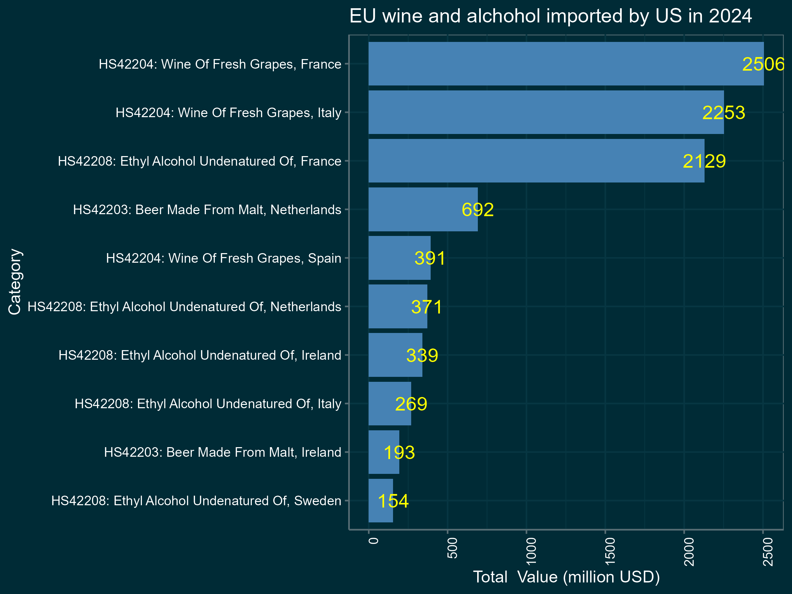

Furious with the EU response, Trump tweeted that he will impose 200% tariffs on French wine and other alcohol from EU. The number iteslf raised several eyebrows, as it is not clear how he came up with it. His own Secretary of Treasurey, Scott Bessent, was not aware of the decision.

Here is the interview with Scott Bessent:

<iframe width="560" height="315" src="https://www.youtube.com/embed/xtT6pajnWf8?si=vVRoGhFbN1F6ZfDp&amp;start=202" title="YouTube video player" frameborder="0" allow="accelerometer; autoplay; clipboard-write; encrypted-media; gyroscope; picture-in-picture; web-share" referrerpolicy="strict-origin-when-cross-origin" allowfullscreen></iframe>

This is a significant escalation, as the US is the largest importer of French wine, with 2.5 bln USD of imports in 2024. Overall in 2024 US imported 10.3 billion USD of alchohol from EU. 

The tariffs are expected to have a significant impact on the US economy, as the prices of wine in US will go up in the short to medium term, leading to inflation and lower output in all industries that use these products. 
