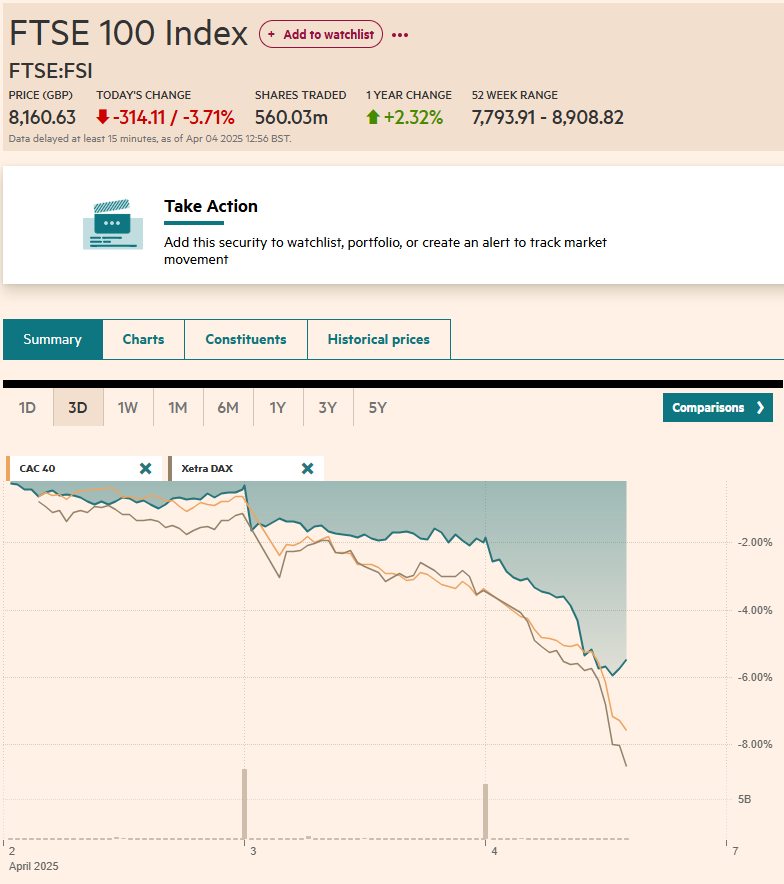
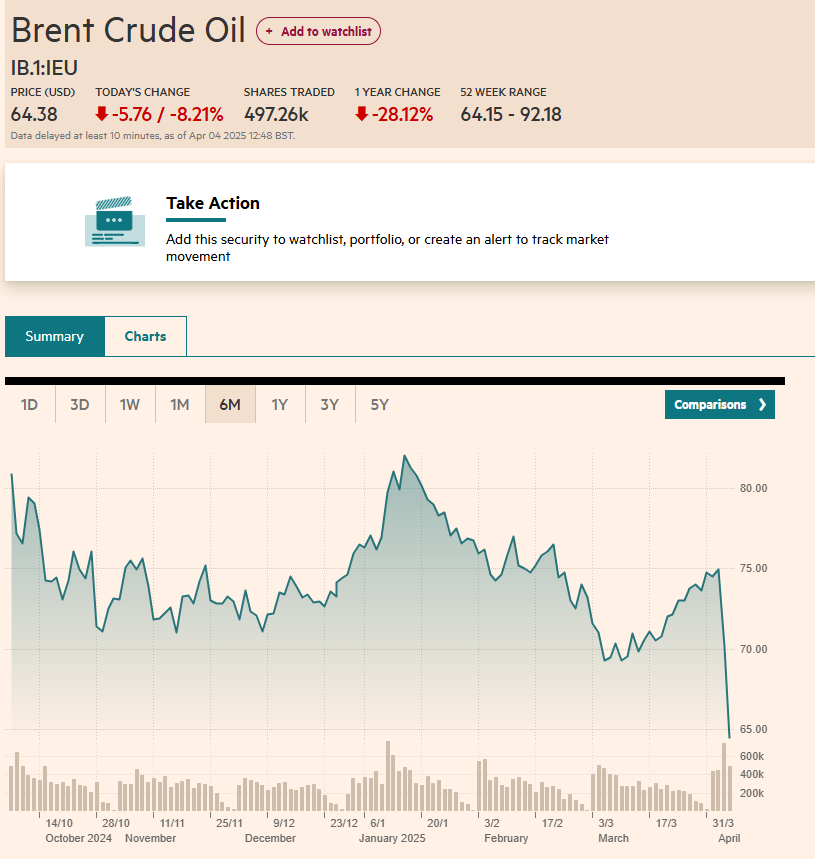

## China retaliates

Taking a short pause, China announced a reciprocal 34% tariff on all US imports, effective April 10. The move is a direct response to Trump's recent tariff hike and is expected to escalate trade tensions further.

Trump's administration imposed 34% tariffs on Chinese imports earlier this week, pushing total U.S. tariffs on Chinese goods beyond 60%, exceeding his earlier threats. China criticized the move as "unilateral bullying" and detrimental to international trade norms.

Financial markets worldwide reacted negatively. Wall Street saw losses totaling approximately $2.4 trillion, with global stocks continuing to slide for a second consecutive day. Europe's STOXX 600 dropped by 3.1%, marking a weekly decline of 6.6%, its largest since February 2022. Germany's DAX index fell 4.8%, the FTSE 100 declined by 2.6%, and Japan's Nikkei 225 also decreased by 2.8%.

Global stock markets experienced another sharp declines following China's announcement of retaliatory tariffs of 34% on all U.S. imports, set to take effect on April 10. The decision by Beijing was a direct response to the latest tariff hike by President Donald Trump, escalating trade tensions toward a potential full-blown trade war.

Oil prices reacted the most, as there is a risk of supply disruptions. Brent crude oil fell by 8.21% to $64.38 per barrel.

China's countermeasures specifically target key U.S. exports, including agriculture products, pharmaceuticals, crude oil, and liquefied natural gas. Additionally, China introduced export bans on several rare earth minerals and placed U.S. tech companies, such as drone makers Skydio and Brinc Drones, onto its "unreliable entity" list, preventing them from sourcing components from Chinese suppliers.
