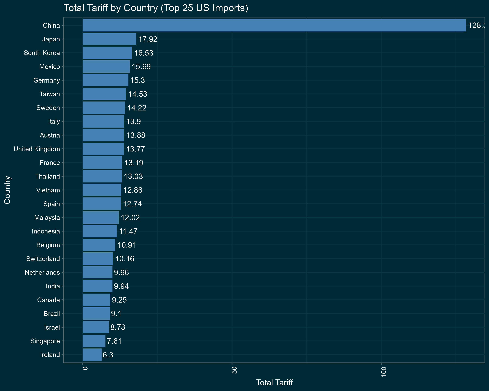

After bond market showed sell-off of US bonds and interest rates spiked, after China showed no sign of surrender, and after EU agreed the first wave of retaliatory tariffs, D. Trump threw a white flag and cancelled his "reciprocal" tariffs. 

Some pundts and Trump supporters are claiming that that was a move of a genius to negotiate concessions from the countries on reciprocal list. And they claim that the fact that a country that retaliated - China - has been demonstrably punished is the evidence of that. However, it negate the whole bring back manufacturing strategy and introduce high uncertainty, so nothing tangible has been achieved and the US position is now much worse than before the Liberation Day. It remains to be seen what kind of concessions Trump will get from the 50+ countries that by Trump own words are lined up to negotiate.

While it seems like a big concession, it is actually not. In the reciprocal tariffs, about 40% of trade was either exempt or had sctoral tariffs. Now all goods got 10 percentage point higher tariffs, which is still the highest US tariff rate in 60 years.

As things stand at the moment: 

- Tariff on China increased by 125 percentage points
- 10 percentage point baseline tariff is applied to all countires, including Canada and Mexcico
- Bond market freaked out
- Uncertainty for the next 90 days and beyond and detroyed US credibility will lead to collapse of investments in US
- Sectoral tariffs on Cars, Steel, Aluminium remain. New sectoral tariffs on Pharmaceutical and lumber are coming soon.

Taking into account all the above and using 2023 annual US imports as weights, even with the 10% baseline tariff, the trade weighted average US tariff rate is now 28%. Not good.

Based on 2023 trade weighted average tariffs, all new sectoral tariffs (auto, steel, aluminium), current Annex II exclusion list and special regime for Canada, Mexico and China, US now one of the highest tariff countries in the world. 

The thing to watch in the months to come is China-US relationship and EU-US negotiations

There were evidence of insider trading

