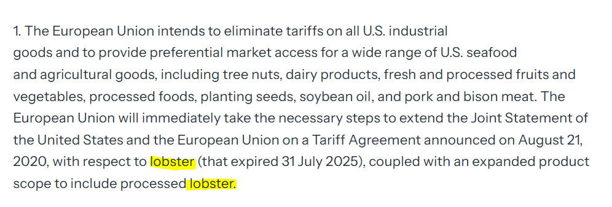
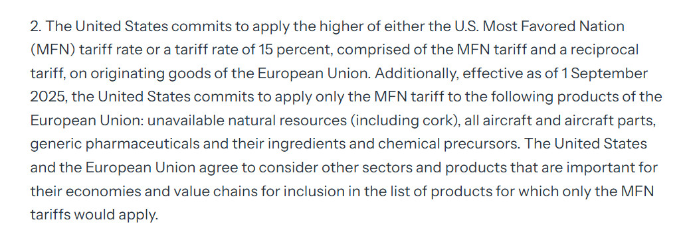
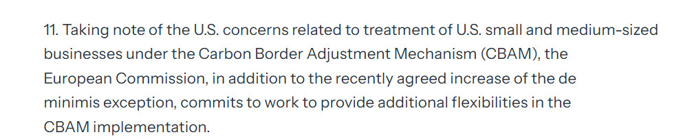

After Lutnick was challenged to present any evidence of the new "trade deals" with countries like Vietnam, Korea,Japan, and EU White House has finally published a joint [statement](https://www.whitehouse.gov/briefings-statements/2025/08/joint-statement-on-a-united-states-european-union-framework-on-an-agreement-on-reciprocal-fair-and-balanced-trade/) on US - EU Framework on and Agreement on Reciprocal, Fair, and Balanced Trade. 

A lot to unpack here. Tariffs on EU produced cars will be set at 15% only after EU eliminates tariffs on industrial goods. There is also a promise not to intorduce tariffs on EU pharmaceuticals goods above 15%. 

Interestingly, lobsters are prominently featured in Article 1 of the document twice:

Article 2 introduces a list of products where only MFN tariffs will apply, making Brexiteers of the UK bite their fingers off. Another failed Brexit dividend case.

EU also promises  "additional felxibilities" in the CBAM implementation:

 EU also promised to be gentle with US firms on the Corporate Sustainability Due Diligence Directive (CSDDD) and the Corporate Sustainability Reporting Directive (CSRD) in Article 12 and not to impose digital taxes on US firms in Article 17. 

 EU and US also promised to work together on rules of origins and mutual recognition of non-tariff measures.

 A cherry on the cake is the EU promise to invest 600 billion USD in the US by 2028, which is a part of the "investment" that Trump has been asking from all countries in exchange for lower tariffs.

 In sum, lots of promises and work ahead. Not much of a trade deal yet, but a memorandum of intention with agreement on set default rates while they are making progress.

 ## Day 225, September 5, 2025

 The first rule of Trump trade deals - there are no rules. It is a problem, cause it creates uncertainty and reduces trade conditional on existing tariffs. Also, I have a feeling that the only stable equilibrium here is the 1930's full scale trade war.

 Trump is threatening to impose new tariffs on EU if it does not remove charges it introduced on Google.

 

 ## Day 246, September 26 2025

Trump announcse 25% tariffs on Heavy Trucks, 30% on Upholstered Furniture, 50% on all Kitchen Cabinets and bathroom vanities, and 100% on all branded or patented Pharmaceutical products. Wierdly, no tariff will be imposed if a company is building plants in America, so this is a company-specific tariff!

IN 2024, there were 212 billion USD of pharmaceutical goods (HS30) imported to US, with 50 billion from Ireland, 18.9 from Switzerland, and 17 from Germany. UK imports were 7.3 billion. 47 bln USD of motor vehicles for the transport of goods (HS8704), mostly from Mexico 37 billion and Canada 7 billion, but UK also delivered 1 billion worth of good transport vehicles, while not more than gvw 5 metric tons, so not clear if it is considered as heavy truck or not. and 24.7 bln USD furniture (HS9403), mostly from Vietnam 7.4 and China 5.7 billion, but also Italy 1.2 billion. UK value was 290 million USD.

While not all of that will be tariffed, as the targets may be more specific, there are several quesitons: how it plays with existing "trade deals" between US and EU, UK and others? Sould countries raise tarifs against US in retaliation? Will it trigger protectionist tariffs against China to deflect diversion?
