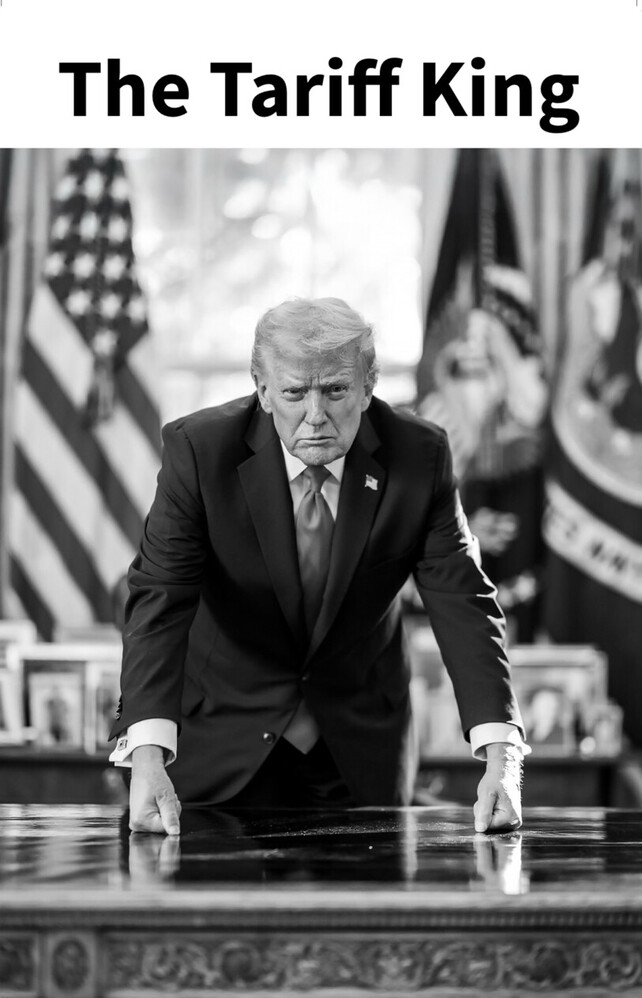

Over the last several months, there were no significant changes in the trade policy diary, until post -New Year period, when Trump announced a new wave of tariff threats asking for political consessions from several countries.

On January 12, 2026 He demanded that all countries stopped trading with Iran, threatening to impose 25% tariffs on all imports from countries that do not comply with this demand. 

On January 17 , 2026 He posted this photo, proclaiming himself  and he started assault on Denmark demanding it to seed Greenland to US, threatening to impose 25% tariffs on all imports from Denmark if it does not comply with this demand. 

To follow through, he declared now infamous "Greenland Tariffs" later in the day promising 10% tariff on Feeb 1 on eight European countries, who sent troops to Greenland as part of NATO mission, and 25% tariff on the same countries by June, if Denmark does not agree to sell Greenland to US.  The sending of troops to Greenland was a symbolic move to demonstrate the solidarity, it was tiny military deployment, UK for instance sent only 1 person and Germany withdraw its troops right after the announcement of tariffs. Volodymyr Zelensky called it rather pathetic move, demonstartion of European weakness.

The both threat of tariffs on Iran and European countries demonstrated that Trump is going to use tariffs as a political tool to achieve his geopolitical objectives, rather than for trade policy purposes. It is vulnerable to the decision of the US supreme court who will deliver its verdict on the legality of tariffs imposed by Trump without approval of the US Congress. If the court decides that Trump exceeded his authority, all tariffs imposed by him may be declared illegal and removed. So the legal ground is shacky, but it creates political drama and increase uncertainty for businesses. People say that Trump TACO, which is true until it is not, as in the case of Venezuela, where he caputred its president Maduro and delivered him to the US court in New York.

Trump reversed his position on Greenland at Davos conference, on Jan 21 2026 saying that the issue is resolved after the conversation with NATO secretary general Mark Rutte.  It is a temporary truce and the story will continue. But for now, the threat of quick NATO disintegration and occupation of Denmakr territory by US is removed.

He continued putting preassure on countries including Canada over its trade agreement with China on Jan 24,  threatening to impose 100% if Canada if it signs the deal. 

Finally, today Jan 27, 2026 he announced an increase in tariffs on Korea from 15 to 25% because Korea's Legislature hasn't inacted the Korea-US deal. .

At the same time other countries and trade blocks are deleveraging from US, with Canada signing a trade deal with China and with EU on SAFE framework, for EU weapons procurement. EU singing deals with MERCOSUR and India, and UK turning towards China.
