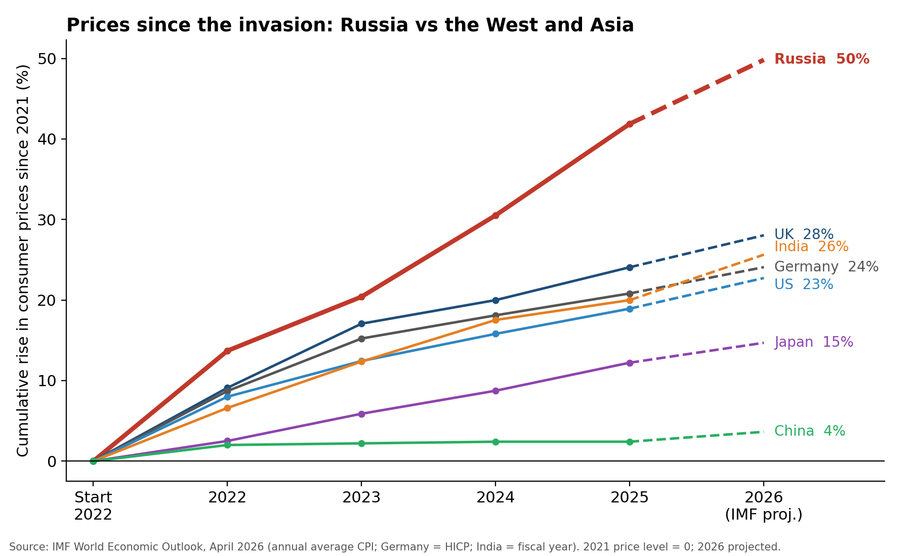
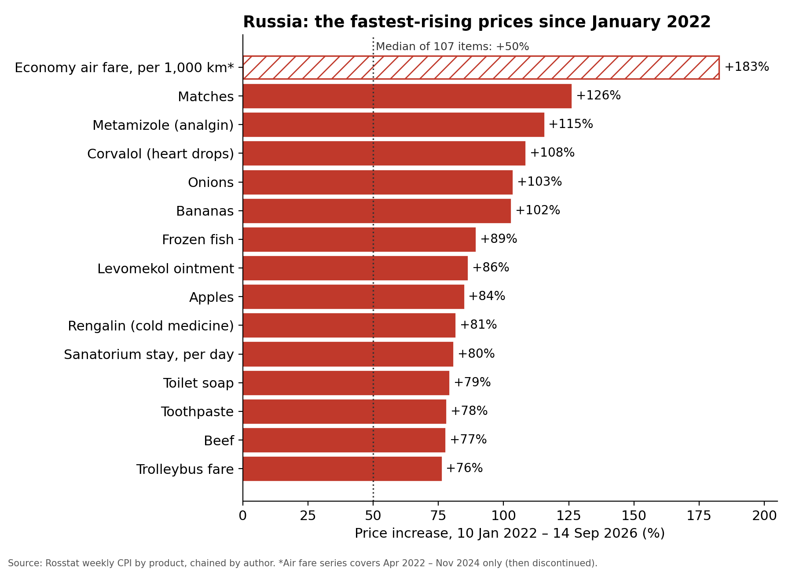

Remember 2022? Energy prices went through the roof, supermarket receipts started looking like phone numbers, and "cost of living" became the most-searched phrase in every Western capital. It was the worst inflation shock in forty years.

Now picture that shock, doubled, and never really ending. Welcome to Russia.

## The race nobody wants to win

Start every major economy at zero in January 2022 and let the prices run. By the end of 2026:

- 🇷🇺 **Russia: +50%**
- 🇬🇧 UK: +28%
- 🇮🇳 India: +26%
- 🇩🇪 Germany: +24%
- 🇺🇸 US: +23%
- 🇯🇵 Japan: +15%
- 🇨🇳 China: +4%

Russia isn't just ahead. It's in a different race.

Look at the shape of the lines, too. Western inflation was a fever: it spiked, broke, and faded back toward normal. Russia's line never bends. The 2022 shock ran straight into a war economy: record military spending pumping money into the system, sanctions choking off imports, and a rouble that keeps sliding. Prices have been climbing for nearly five years without a break.

## Inflation kills governments. Usually.

In the democracies, voters knew exactly whom to blame.

Britain's Conservatives were wiped out in their worst defeat ever. America's Democrats lost the White House. Germany's coalition collapsed, and the SPD crashed to its worst post-war result. Japan's LDP lost its majority. Even Narendra Modi lost his. Macron ended up with a hung parliament.

The lesson was brutally simple: if prices go up on your watch, you're out.

Then came Russia. In September 2026, with prices up by half since the invasion, Russians went to the polls and handed United Russia **355 of 450 seats in the Duma. That's nearly 80% of parliament**, the biggest majority the party has ever had. The only anti-war party was kicked off the ballot before a single vote was cast.

The worst inflation among the major economies produced the biggest ruling majority on record.

## Inside the Russian shopping basket

Headline numbers hide the pain. So I opened up Rosstat's own weekly price data for more than a hundred everyday goods and services, and tracked every one of them since January 2022.

The typical item is up 50%. The worst ones have doubled, tripled, or disappeared from the statistics altogether.

**Flying is for the rich now.** Economy air fares jumped **183%** in just two and a half years. Then Rosstat quietly stopped publishing the series. Without Western planes, parts and leases, Russian aviation is flying on borrowed time, and passengers are paying for it.

**Getting sick costs double.** The biggest increases aren't luxuries. They're in the medicine cabinet:

- Analgin, the country's go-to painkiller, is up **115%**.
- Corvalol, the heart drops in every Russian grandmother's handbag, is up **108%**.
- Levomekol ointment is up **86%**.
- Rengalin cold medicine is up **81%**.

**Even matches doubled.** A box of matches is up **126%**. Onions, bananas and apples have all doubled or come close. Frozen fish is up **89%**. A day at a sanatorium, the classic Russian holiday, costs **80%** more.

**A trip to the barber?** Men's haircuts are up **47%** since 2023, and a car wash **64%**.

### What's on the dinner table

|                   | Price increase since Jan 2022 |
|-------------------|------------------------------:|
| **Beef**          | **+77%**                      |
| Lamb              | +73%                          |
| Chicken           | +50%                          |
| Pork              | +33%                          |
| Sausage           | +38%                          |
| **Frozen fish**   | **+89%**                      |
| Butter            | +51%                          |
| Milk              | +49%                          |
| Sour cream        | +46%                          |
| Cheese            | +44%                          |
| **Wheat bread**   | **+64%**                      |
| Rye bread         | +61%                          |

And here's the one that should make every Russian angry. Russia is the **world's biggest wheat exporter**. It is drowning in grain. Yet a loaf of bread costs almost two-thirds more than it did when the war began.

## Why the bill never reaches the ballot box

So why does the same shock topple governments in London and Washington, but crown one in Moscow?

Because Russia's democracy is a stage set. It has a parliament, parties, elections, and an election commission proudly announcing "record turnout." It has all the props and none of the substance. Behind the facade, three things are at work.

**Fear.** In a real democracy, voting your wallet is the most normal thing in the world. In Russia, voting against the government is a statement of disloyalty, and disloyalty has consequences: at work, in a state job, in your neighbourhood. The ballot is supposed to be secret. Nobody quite believes it.

**Cynicism.** A century of history has taught Russians one lesson above all: *you can't change anything.* The state does what it wants. Individual freedom is either a Western fairy tale or a road back to the chaos of the 1990s. So people don't fight the system. They keep their heads down, look after their families, and adapt.

**Hostility.** When you can't blame the people in charge, the anger has to go somewhere. So it goes outward: to sanctions, to the West, to foreigners, to migrants, to "enemies." The Kremlin feeds this, but it didn't invent it.

The result is a country that swallows a 50% jump in the cost of living, and thanks its rulers with a landslide.

Western voters threw out their governments over 25% inflation. Russians got 50%, and gave their government a record majority.

---

*Sources: IMF World Economic Outlook (April 2026); Rosstat weekly consumer prices, 10 Jan 2022 – 14 Sep 2026, indexed by the author; Russian Central Election Commission, preliminary results.*
