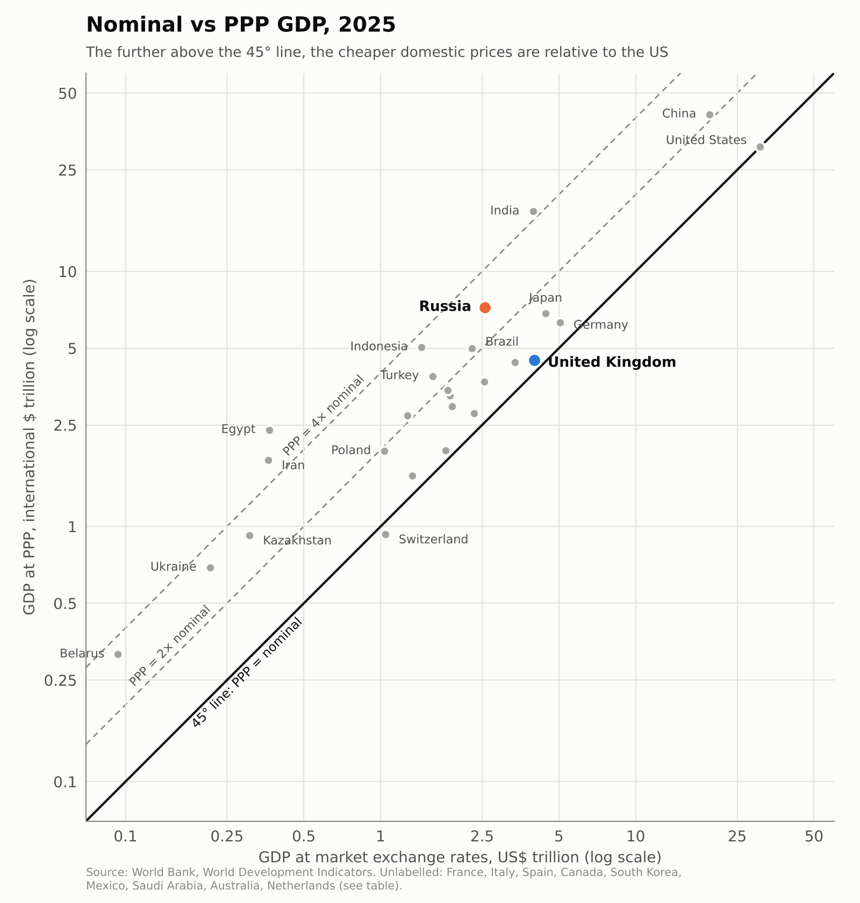

In his new interview with Jacob Rees-Mogg, Tucker Carlson told him that Russia has "a much larger economy" than Britain. Rees-Mogg replied: "No, it hasn't got a larger economy than Britain. It's got a smaller economy than Britain. It's got a larger military."

Carlson was repeating a Kremlin talking point. In January 2024 Vladimir Putin told entrepreneurs in Khabarovsk that "we are the largest economy in Europe. We left Germany behind" — and he made the same claim a month later in his interview with Carlson. Both times Putin was talking about GDP at purchasing power parity (PPP), though he didn't always say so.

The same argument keeps coming up when people compare the United States and China. Measured at PPP, China's economy has been larger than America's since the mid-2010s: in 2025 it was 41 trillion international dollars against 31 trillion. At market exchange rates China is still only about two-thirds the size of the US ($19.5 trillion against $30.8 trillion). So which number is the right one?

## Two measures for two different questions

**Nominal GDP**, converted at market exchange rates, measures what an economy's output is worth in world markets. That's the right measure of economic *size and power in a global economy*. Oil, chips, machine tools, drone components, foreign assets, debt service and payments to allies are all bought at world prices, paid for in hard currency at the market exchange rate. A country's capacity to act internationally depends on what its income can buy abroad.

**PPP GDP** revalues domestic output at a common set of prices. That's the right tool for comparing *living standards*, so it belongs with GDP per capita. A haircut, a bus ride or a flat costs much less in Moscow than in London, and comparing incomes without correcting for this would overstate how much poorer Russian households are. PPP answers "how much can residents buy at home?" It doesn't answer "how much weight does this economy carry in the world?"

## The accounting: the gap *is* the price level

Let $Y$ be nominal GDP in local currency, $E$ the market exchange rate (local currency per US dollar) and $PPP$ the PPP conversion factor (local currency per international dollar). Then

$$
GDP^{MER} = \frac{Y}{E}, \qquad GDP^{PPP} = \frac{Y}{PPP}
\quad\Longrightarrow\quad
\frac{GDP^{MER}}{GDP^{PPP}} = \frac{PPP}{E}.
$$

The ratio $PPP/E$ is the **price level index**: the country's price level relative to the United States. If it is below one, PPP GDP exceeds nominal GDP.

In 2025 Russia's price level was about **35% of the US level** (2.56/7.24). The UK's was **89%** (4.00/4.49). That difference in price levels is the whole of the "Russia is bigger" claim. In dollars, Russia's economy is about 64% of Britain's. At PPP it is about 1.6 times larger.

## Why price levels differ: tradables and non-tradables

Write the price level as a composite of tradables ($T$) and non-tradables ($N$):

$$
P = P_T^{\alpha}\,P_N^{1-\alpha}.
$$

For tradable goods, arbitrage pushes towards the law of one price, $P_T \approx E\,P_T^{*}$. Nothing equivalent holds for non-tradables such as housing, haircuts, construction, healthcare, education and public administration, which make up most of GDP. So even with free trade, $P \neq E\,P^{*}$ and $PPP \neq E$.

The systematic part of the gap is the Balassa–Samuelson (Penn) effect. Productivity growth in tradables raises wages, which spill over into services where productivity grows more slowly:

$$
A_T \uparrow \;\Rightarrow\; w \uparrow \;\Rightarrow\; P_N \uparrow \;\Rightarrow\; \frac{PPP}{E} \uparrow .
$$

Richer countries have higher price levels, so their PPP and nominal GDP are closer together. Poor countries sit far above the 45° line (see the chart below).

## Integration narrows the gap; fragmentation widens it

Integration closes the gap through three channels, each working on a different wedge:

- **Goods-market integration** equalises tradable prices directly. It is the strongest and most direct channel.
- **Labour mobility** pushes towards equal wages, and labour is the main cost of non-tradable services. That makes it a powerful channel for price-level convergence.
- **Capital mobility** equalises risk-adjusted returns, $r \approx r^{*} + \text{risk premium}$, not goods prices. It narrows the gap only indirectly, through capital deepening and productivity catch-up. In the short run it can *widen* deviations, because under open capital accounts the exchange rate behaves like an asset price driven by portfolio flows.

Even full liberalisation doesn't deliver $PPP = E$. Land, local amenities, taxes, regulation and productivity still differ. The euro area has free movement of goods, capital and people and a single currency, yet price levels still differ a lot across its members. Integration reduces the gap. It doesn't remove it.

The flip side is the point that matters for Russia. **If integration ties $PPP$ and $E$ together, fragmentation lets them drift apart.**

## Russia: an experiment in reverse globalisation

Since 2022 Russia has been cut off from Western goods, finance and technology by sanctions, and it has imposed its own capital controls: mandatory sale of export revenue, limits on transfers abroad, and restrictions on transactions with non-residents. All three integration channels have been weakened at once.

| Year | Nominal GDP (US$ tn) | PPP GDP (int. $ tn) | PPP / nominal | Price level (US = 100) |
|---|---:|---:|---:|---:|
| 2021 | 1.83 | 5.69 | 3.11 | 32 |
| 2022 | 2.29 | 6.01 | 2.62 | 38 |
| 2023 | 2.05 | 6.48 | 3.17 | 32 |
| 2024 | 2.19 | 6.97 | 3.19 | 31 |
| 2025 | 2.56 | 7.24 | 2.82 | 35 |

*Source: World Bank, World Development Indicators.*

Between 2022 and 2024, dollar GDP *fell* by about 5% while PPP GDP rose by about 16%. Several mechanisms are behind this.

**1. The ruble is priced in a segmented market.** With capital outflows restricted and imports cut, the exchange rate is set mainly by the trade balance under administrative controls, not by arbitrage. In 2022 energy revenue flooded in, imports collapsed and capital couldn't leave. The ruble appreciated and dollar GDP jumped by 25% *while real output contracted*. When export revenue weakened and imports recovered, the ruble fell back and dollar GDP fell with it. The ratio swings with the ruble (2.6 in 2022, 3.2 in 2024, 2.8 in 2025), which is what an exchange rate cut off from goods and capital arbitrage looks like.

**2. Arbitrage in goods is broken.** Sanctioned goods now arrive through third countries, with intermediary margins, compliance risk and financing costs:

$$
P^{RU}_T = E\,P^{W}_T\,(1+\tau), \qquad \tau = \text{sanctions and transaction wedge}.
$$

With weaker links between domestic and world prices, a low domestic price level can persist alongside an exchange rate driven by other forces. In effect the ruble has two values: a domestic one (what it buys in Russia) and an external one (what it buys in the world). Integration keeps the two close. Isolation lets them diverge.

**3. War production inflates PPP output.** GDP measures production, not welfare. A tank built in Nizhny Tagil, paid for with domestic labour and steel at domestic prices, counts fully in PPP GDP. It creates no dollars that Russian households or firms can spend abroad. A war economy boosts exactly the part of output that PPP values most generously.

In short, PPP GDP describes how much domestic labour and material the Russian state can mobilise. Nominal GDP describes what Russia can buy in a world that is increasingly closed to it. Sanctions are aimed at the second capacity. A widening wedge between the two partly measures how far they have worked.

## Russia compared with other countries

Russia's ratio is not extreme in global terms. India, Indonesia and Egypt sit further above the 45° line because they are much poorer. The useful comparison is with countries at similar or lower income per head: Turkey (2.4), Brazil (2.2) and Mexico (1.9) all have smaller gaps than Russia (2.8). Russia's ratio is closest to Kazakhstan (3.0), Ukraine (3.2) and Belarus (3.4).

*Figure: GDP at market exchange rates against GDP at PPP, 2025 (log scales). Points on the 45° line have US price levels; dashed lines mark PPP GDP equal to two and four times nominal GDP.*

| Country | Nominal GDP (US$ tn) | PPP GDP (int. $ tn) | PPP / nominal | Price level (US = 100) |
|---|---:|---:|---:|---:|
| United States | 30.77 | 30.77 | 1.00 | 100 |
| China | 19.50 | 41.26 | 2.12 | 47 |
| Germany | 5.05 | 6.30 | 1.25 | 80 |
| Japan | 4.44 | 6.84 | 1.54 | 65 |
| **United Kingdom** | **4.00** | **4.49** | **1.12** | **89** |
| India | 3.96 | 17.20 | 4.35 | 23 |
| France | 3.37 | 4.40 | 1.31 | 77 |
| **Russia** | **2.56** | **7.24** | **2.82** | **35** |
| Italy | 2.55 | 3.70 | 1.45 | 69 |
| Canada | 2.32 | 2.78 | 1.20 | 83 |
| Brazil | 2.28 | 4.99 | 2.19 | 46 |
| Spain | 1.91 | 2.95 | 1.55 | 65 |
| South Korea | 1.87 | 3.26 | 1.74 | 57 |
| Mexico | 1.83 | 3.41 | 1.86 | 54 |
| Australia | 1.80 | 1.99 | 1.10 | 91 |
| Turkey | 1.60 | 3.89 | 2.43 | 41 |
| Indonesia | 1.45 | 5.05 | 3.49 | 29 |
| Netherlands | 1.33 | 1.58 | 1.19 | 84 |
| Saudi Arabia | 1.28 | 2.73 | 2.14 | 47 |
| Switzerland | 1.04 | 0.93 | 0.89 | 112 |
| Poland | 1.04 | 1.98 | 1.91 | 52 |
| Egypt | 0.37 | 2.39 | 6.55 | 15 |
| Iran | 0.36 | 1.82 | 5.02 | 20 |
| Kazakhstan | 0.31 | 0.92 | 3.01 | 33 |
| Ukraine | 0.21 | 0.69 | 3.22 | 31 |
| Belarus | 0.09 | 0.32 | 3.38 | 30 |

*Source: World Bank, World Development Indicators, 2025. Price level = nominal / PPP GDP × 100.*

Two caveats apply. First, Kazakhstan, Ukraine, Belarus and Russia are all priced within the CIS block of the International Comparison Program (ICP). In ICP 2021 Russia moved from the OECD comparison to the CIS one. Part of Russia's rise in PPP rankings is therefore a statistical revision, not economic news. Second, PPPs between benchmark years are extrapolated from relative inflation and assume comparable baskets. When sanctions make Western goods scarcer, lower-quality or available only through grey imports, measured Russian prices probably understate the true cost of the basket. That biases Russian PPP GDP upwards.

## We have seen this before: the Soviet Union

None of this is new. The Soviet Union was a more extreme version of the same economy: isolated from world markets, with a non-convertible ruble and no market prices. Prices were set administratively by the State Committee on Prices (Goskomtsen). Retail prices of meat and dairy products stayed unchanged from 1962 until 1991, whatever happened to costs or demand. The official exchange rate of roughly 0.6 rubles to the dollar bore no relation to the black-market rate, which was many times higher.

Without market prices there was no way to know what Soviet output was actually worth. The planning system produced enormous quantities of tanks, ballistic missiles, steel and jars of pickles. Meanwhile consumers queued for toilet paper and salami, and "sausage trains" carried shoppers from the provinces to Moscow. János Kornai called this the *economy of shortage*: chronic excess demand for what people wanted, alongside unsold stocks of what the plan said they should want.

In the language of this post, Soviet output was valued at prices that did not come from arbitrage, either domestic or international. Value added at domestic administered prices,

$$
VA^{dom} = \sum_i p_i^{dom} q_i - \sum_j p_j^{dom} m_j ,
$$

could look healthy. Revalued at world prices,

$$
VA^{world} = E\left(\sum_i p_i^{W} q_i - \sum_j p_j^{W} m_j\right),
$$

it was often much smaller and sometimes negative: industries that destroyed value by turning cheap energy and metals into goods nobody abroad would buy. Studies of Soviet and East European industry after 1989 found exactly such "negative value added" sectors. Western estimates that put the Soviet economy at about half the size of the US also proved far too high once prices were freed.

The collapse, when it came, was fast. As Yegor Gaidar documented in *Collapse of an Empire*, the late Soviet economy depended on oil and gas exports to pay for imported grain and consumer goods. When oil prices fell in the mid-1980s, hard-currency earnings dried up, foreign borrowing filled the gap for a few years, and then the system ran out of options. An economy that looked enormous in physical output and administered-price statistics unravelled within about five years.

Today's Russian war economy shows some of the same symptoms:

- a growing share of output is allocated by state defence orders rather than markets;
- labour and capital are pulled from civilian sectors into military production;
- the ruble is managed through capital controls;
- imports of technology depend on intermediaries;
- the budget relies on hydrocarbon revenue that sanctions and oil prices can squeeze.

Tanks and missiles are valued in GDP at what the state pays for them. They add to PPP output but earn no foreign currency and raise no living standards.

There are also important differences. Most civilian prices in Russia are still set by markets. Private firms, a floating (if managed) exchange rate and Chinese supply chains give the economy far more ability to adjust than Gosplan ever had. A Soviet-style collapse is not inevitable. But the lesson of 1985–1991 is that physical output measured at prices insulated from world markets can hide how fragile an economy is. When the external constraint finally binds, the adjustment can be abrupt rather than gradual.

## So is Russia bigger than Britain?

Only if "bigger" means the volume of domestic output valued at common prices. For what a country can buy, finance and sustain in the world economy (which is what Carlson's argument about power and resources is really about), Russia's economy is about two-thirds the size of Britain's. Its large PPP-to-nominal gap isn't evidence of hidden strength. It reflects low domestic prices, a war economy and isolation from global markets. The Soviet Union also looked big on paper until it ran out of hard currency. PPP remains the right measure for comparing living standards, which is a different question.

---

**Sources**

- [Tucker Carlson savaged over car-crash Jacob Rees-Mogg interview (AOL)](https://www.aol.co.uk/articles/tucker-carlson-savaged-over-car-114300000.html)
- [Snopes: Putin's claim that Russia is the largest economy in Europe](https://www.snopes.com/fact-check/russia-largest-economy-in-europe/)
- [World Bank Open Data: Russian Federation](https://data.worldbank.org/country/russian-federation); WDI indicators NY.GDP.MKTP.CD and NY.GDP.MKTP.PP.CD
- [FRED: Gross Domestic Product for Russian Federation (World Bank series)](https://fred.stlouisfed.org/series/MKTGDPRUA646NWDB)
- [World Bank International Comparison Program](https://www.worldbank.org/en/programs/icp)
- Gaidar, Y. (2007). *Collapse of an Empire: Lessons for Modern Russia*. Brookings Institution Press.
- Kornai, J. (1980). *Economics of Shortage*. North-Holland.
- Hughes, G. and Hare, P. (1991). "Competitiveness and Industrial Restructuring in Czechoslovakia, Hungary and Poland." *European Economy*, Special Edition No. 2.
