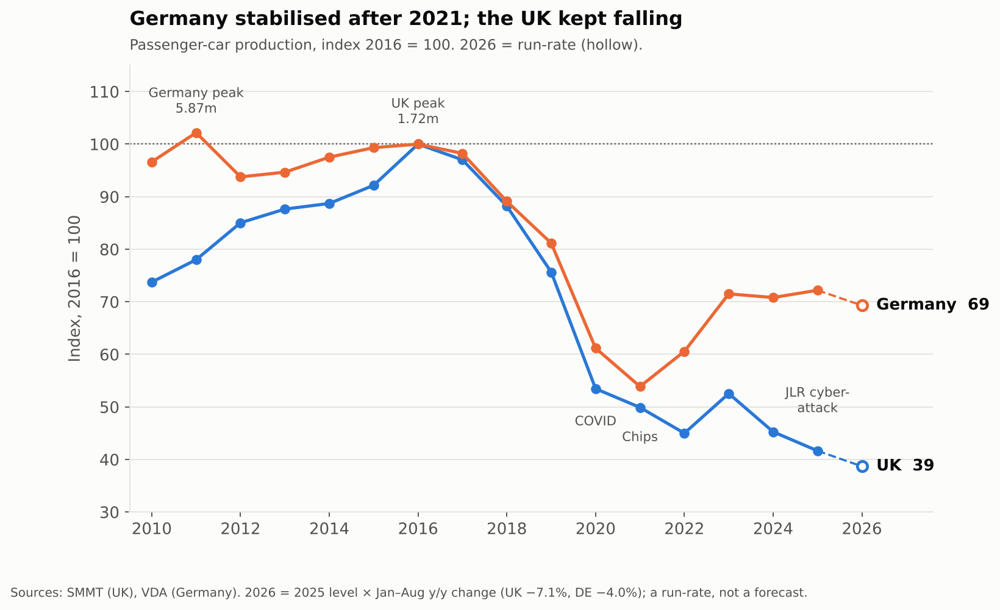
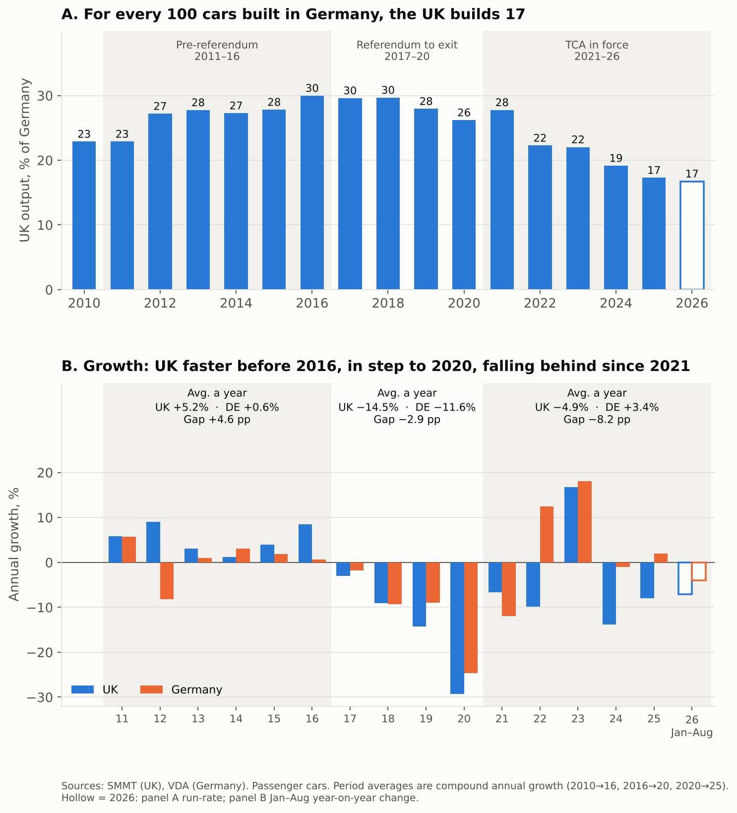
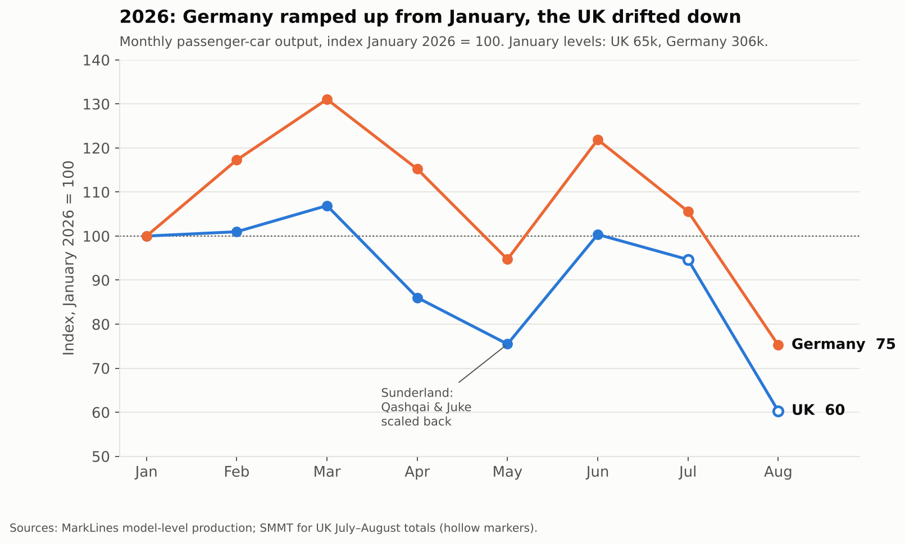
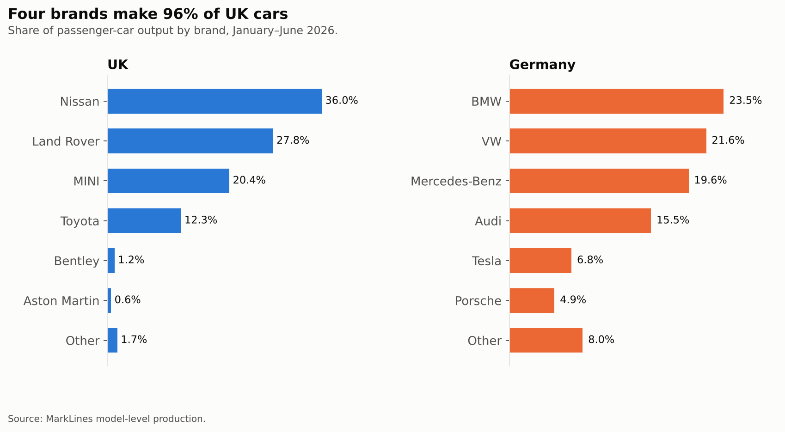

In 2016 British factories built 1.72 million cars, more than in any year since 1999. Last year they built 717,000. Over the same decade German output also declined, from 5.75 million to 4.15 million, but the difference in scale is striking. Germany lost just over a quarter of its production; Britain lost almost three-fifths. In 2016 the UK built thirty cars for every hundred made in Germany. Today it builds seventeen.

It is tempting to treat this as one more casualty of a turbulent decade of diesel scandals, pandemic closures and semiconductor shortages. But Germany went through all of these too. What it did not go through was Brexit. Using Germany as a benchmark, this post argues that Britain's decline happened in two Brexit stages. The years of uncertainty after the referendum weakened the industry. The trade regime that replaced EU membership did more lasting damage.

The argument builds on recent work at Aston's Centre for Business Prosperity. In [Du, Shepotylo and Shi (2025)](https://www.aston.ac.uk/research/bss/research-centres/business-prosperity/destruction-eu-uk-trade), Jun Du, Yujie Shi and I use synthetic difference-in-differences on monthly product-level trade data to estimate what the TCA did to UK–EU trade. Five years on, UK export values to the EU are 16.5% below their counterfactual. The number of products traded has fallen much further: export varieties are down 53.8%, and the decline is still deepening with no sign of recovery. The damage is selective. Where UK and EU firms are tied together by shared production networks (and automotive components are one of the clearest cases), trade has largely held up. Where those ties are thinner, trade relationships have been cut. The car industry is a demanding test of that finding. It is the most deeply integrated supply chain Britain has with Europe, and it is also the industry where integration is now being tested hardest.

## Three acts in a decade

*Figure 1. Passenger-car production, index 2016 = 100. The 2026 values are a run-rate based on January–August.*

**The first act was a British boom.** Between 2010 and 2016 UK car output rose by 36%, about 5.2% a year, as Nissan, Jaguar Land Rover, MINI and Toyota added models and shifts. German domestic production rose by 3.5% over the whole period, about 0.6% a year. German carmakers were expanding, but they did so mainly in Central Europe, Mexico, the United States and China. Britain, inside the single market and with flexible labour and an established supplier base, was one of the most attractive places in Europe to build a car.

**The second act, from 2017 to 2020, was a slowdown under uncertainty.** Both industries contracted, under the same shocks of collapsing diesel demand, new emissions testing in 2018 and, finally, the pandemic. But the UK contracted faster. Its output fell by an average of 14.5% a year, against 11.6% in Germany. The gap was widest in 2019, the year of no-deal brinkmanship, when British output fell 14% and German output 9%. The reasons were visible at the time. New investment in the sector fell to £90 million in the first half of 2019, compared with an annual average of about £2.7 billion over the previous seven years. Carmakers moved their summer shutdowns to April to cope with a possible cliff edge at the end of March. Honda announced the closure of Swindon, and Nissan reversed its decision to build the next X-Trail at Sunderland. Formally nothing had yet changed, since the UK remained in the single market and customs union until the end of 2020. But firms decide where to invest years ahead, and they had begun to factor in the risk of leaving.

**The third act began when the risk became a reality.** Since the TCA came into force in January 2021, German car output has risen by 18% and British output has fallen by 22%. Over 2020–2025 that is +3.4% a year against −4.9% a year. Germany recovered to about 72% of its 2016 level and has stayed there. Britain recovered briefly in 2023, then fell to 42%. If the January–August changes for 2026 hold for the rest of the year (UK −7.1%, Germany −4.0%), the two will end 2026 at around 39 and 69 respectively.

## Why the agreement hurt more than the uncertainty

*Figure 2. Panel A: UK passenger-car output as a share of German output. Panel B: annual growth rates. Each period's figures are average annual (compound) growth for 2010–16, 2016–20 and 2020–25.*

Figure 2 sets out the argument in two panels. The UK's output relative to Germany's rose from 23% to 30% before the referendum, eased to 26% during the years of uncertainty, and has since fallen to 17%. In growth rates the pattern is even clearer. The UK grew 4.6 percentage points a year faster than Germany before 2016. It grew 2.9 points a year slower between 2016 and 2020. Since 2020 it has grown 8.2 points a year slower. Uncertainty cost the industry ground; the agreement cost it nearly three times as much.

This is what one would expect. Uncertainty delays decisions, but a trade agreement changes the costs for good, and the TCA changed them in at least three ways that matter for cars.

The first is **rules of origin**. The TCA's zero tariffs are not free. A car qualifies only if enough of its value comes from the UK or the EU, and this has to be documented across hundreds of components and many tiers of suppliers. For electric vehicles, whose batteries are largely Asian in origin, the requirement has been softened by phase-in arrangements that have already been extended once. From January 2027 the full rules apply. According to SMMT estimates, most battery-electric and plug-in hybrid models traded across the Channel will then face tariffs costing at least £1.4 billion.

The second is the **breaking of supply chains**. Car production relies on just-in-time deliveries that cross borders several times before a vehicle is finished. Customs declarations, safety and security filings and the occasional queue at Dover cost little per crossing, but they add up across a production line. Our trade evidence suggests the timing is what matters. Supply-chain lock-in protects the relationships that already exist. A model in production keeps its suppliers because switching mid-cycle costs more than the new paperwork. But when that model reaches the end of its life, and the decision of where to build its replacement comes up, those relationships can be ended at lowest cost. That is why the damage looks slow and selective rather than a sudden collapse, and why it accumulates at the moment that matters most for the industry's future: the allocation of new models.

The third is the **"Made in Europe" agenda**. The European Commission's proposed Industrial Accelerator Act, published in March 2026, would link public support and procurement for electric vehicles to a European-content threshold of 70%. The UK may qualify as a trusted partner under the TCA, but its inclusion has not been decided and could depend on technical definitions. SMMT warns that, as drafted, the proposal would make UK-built vehicles uncompetitive in their largest market. Nissan has reportedly said Sunderland's future depends on the outcome. An industry that exports more than three-quarters of its output, mostly to the EU, cannot be indifferent to whether its cars count as European.

Two caveats keep this reading honest. First, the break is not perfectly clean. In 2021, the first year of the TCA, the UK actually fell less than Germany (−7% against −12%), because the semiconductor shortage hit German plants harder. The divergence becomes unmistakable from 2022, when German output rebounded by 12% and British output fell by another 10%. Second, Britain had shocks of its own: the end of Astra production at Ellesmere Port, and the cyberattack that halted JLR's lines for more than a month in autumn 2025. The eight-point annual gap should therefore be read as an upper bound on the TCA's effect rather than an estimate of it. Even so, the overall sequence of faster growth, then slower growth under uncertainty, then a sharp break under the new trade regime is hard to explain with pandemic and chip disruption, which hit both countries.

## 2026: the anatomy of a vulnerable industry

*Figure 3. Monthly passenger-car output in 2026, index January = 100. UK figures for July and August are SMMT totals.*

The monthly data for this year show what that vulnerability looks like in practice. Between January and August, Germany built about 2.63 million cars and the UK about 473,000. Measured against January, German output was higher in every month from February to July except May, peaking at 131 in March and averaging 116 over February to June. British output averaged 94 over the same months. It was slightly above January in February and March, then got back to that level only once more, in June. By August, when both industries close for summer, Germany stood at 75 and Britain at 60. Because January is seasonally weak in Germany, a January base flatters the German path somewhat. But whatever the base, the spring gap is there: from the first quarter to the second, output fell 15% in the UK and 5% in Germany.

Model-level data show where the British shortfall came from. About nine-tenths of it came from a single plant: lower Qashqai and Juke output at Sunderland cut national production by about 9,000 cars a month, out of a total fall of about 10,000. Range Rover Evoque accounted for most of the rest. Germany had its own dip, but it reflected model renewal rather than retreat. The Audi Q2 and VW Touran ended production in April, while output of the new Mercedes CLA rose from about 1,000 a month to over 6,000 by June. Tesla's Grünheide plant continued its quarter-end surges, and BMW began producing the new electric i3 in July. Germany's model changes in 2026 are renewal. Britain's look more like attrition.

*Figure 4. Share of passenger-car output by brand, January–June 2026.*

The industry's structure makes the problem worse. Four brands produce 96% of British cars, and Nissan alone produces 36%. The national figure therefore rises and falls with a few decisions about individual models at individual plants, and those are exactly the decisions that rules of origin and content requirements now shape. German production is spread across four large manufacturers, each with 15–24% of output, plus Tesla's 7%. The product mix differs as well. Sport utility vehicles make up 63% of British output, against 48% in Germany, and two Range Rover models alone account for a fifth.

Most telling is the gap in electric vehicles. Models built only as fully electric already make up about a quarter of German output in 2026. In Britain, the only fully electric car in production is Nissan's new Leaf, which accounted for about 1% of output in the first half of the year, although it is now ramping up quickly. Yet battery-electric cars are precisely where the 2027 rules of origin and the proposed 70% content threshold apply. The UK industry is entering the most demanding phase of European trade policy while making very few of the products that policy is aimed at.

## Conclusion

A decade ago Britain was one of Europe's fastest-growing car producers. The post-referendum uncertainty cost it ground, but the industry kept pace with its main competitor in direction if not in speed. The TCA then turned a slowdown into a divergence, roughly eight percentage points of growth a year relative to Germany. It did so not through a single shock but through the gradual loss of new models as existing supply chains reached the end of their lives. That is consistent with what my colleagues and I find across UK–EU trade: deep integration protects what already exists, but it does not secure what comes next.

The question for the next two years is whether the UK car industry can still win new models when it matters. With stricter rules of origin due in January 2027, a European content test under negotiation in Brussels, and an industry whose output depends on a few plants, the answer will be decided by trade policy at least as much as by engineering. On current trends the UK is not winning enough of them.

---

### Data and methods

**Annual series.** Passenger-car production for 2010–2025 comes from SMMT (UK) and VDA (German Pkw-Inlandsproduktion). Commercial vehicles are excluded.

**Growth rates.** Period figures are compound annual growth rates over 2010–2016, 2016–2020 and 2020–2025.

**Monthly 2026 data.** These come from MarkLines model-level production, aggregated by country and brand. German monthly totals match VDA. In the UK extract, July car figures replicate January almost model for model, and the August total is about 3,500 below SMMT's. For UK July and August I therefore use SMMT totals (61,767 and 39,328) and rely on model-level UK detail only for January–June.

**2026 run-rate.** The 2025 total multiplied by the January–August year-on-year change. It is an extrapolation, not a forecast.

**On causality.** The comparison with Germany is descriptive and not an estimated treatment effect. For causal estimates of the TCA's effect on UK–EU trade, see Du, Shepotylo and Shi (2025).

### References

Du, J., Shepotylo, O. and Shi, Y. (2025). *Supply Chain Lock-in and the Selective Destruction of EU–UK Trade*. Working paper, Centre for Business Prosperity, Aston Business School / The Productivity Institute. [Summary](https://www.aston.ac.uk/research/bss/research-centres/business-prosperity/destruction-eu-uk-trade) · [Full paper](https://www.aston.ac.uk/sites/default/files/2026-06/Supply%20Chain%20Lock-in%20and%20%20%20the%20Selective%20Destruction%20of%20EU%E2%80%93UK%20Trade.pdf)

SMMT (2026). [Vehicle manufacturing grows alongside £1bn investment boost but EU trade threats loom](https://www.smmt.co.uk/vehicle-manufacturing-grows-alongside-1bn-investment-boost-but-eu-trade-threats-loom/), 30 September.

SMMT (2026). UK automotive output 2025, via [MTA](https://www.mta.org.uk/resources/uk-automotive-output-2025/).

VDA. [Jahreszahlen Automobilproduktion](https://www.vda.de/de/aktuelles/zahlen-und-daten/jahreszahlen/automobilproduktion); [Passenger car production in 2025](https://www.vda.de/en/press/press-releases/2026/260106_Passenger-car-production-in-2025-slightly-above-previous-year-s-level).

CITP (2026). [What "Made in Europe" really means for the UK](https://citp.ac.uk/publications/what-made-in-europe-really-means-for-the-uk).

AFP (2019). [Fearing no-deal Brexit, UK carmakers slam brakes on investment](https://techxplore.com/news/2019-07-no-deal-brexit-uk-carmakers-slam.amp), 31 July.

MarkLines. Model-level vehicle production data, January–August 2026.
